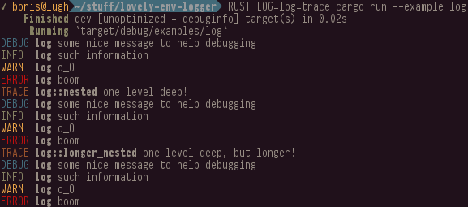
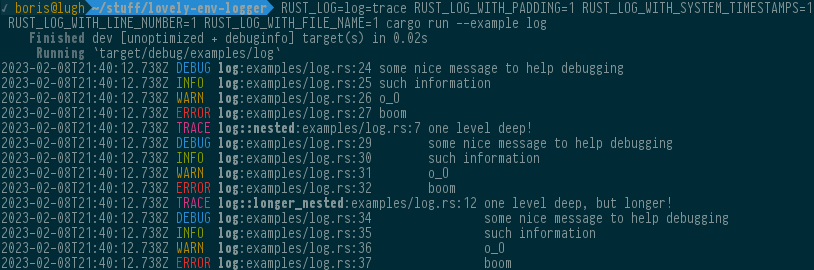

# lovely-env-logger

[](https://crates.io/crates/lovely_env_logger)
[](https://docs.rs/lovely_env_logger)
[](https://crates.io/crates/lovely_env_logger)

A simple logger built on top of [env_logger](https://docs.rs/env_logger).
It is configured via an environment variable and writes to standard
error with nice colored output for log levels.
Originally a fork from [pretty_env_logger](https://github.com/seanmonstar/pretty-env-logger).

## Screenshots




## Usage

Add the dependency to your `Cargo.toml`:

```toml
[dependencies]
log = "0.4"
lovely_env_logger = "0.5"
```

Add some usage to your application:

```rust
extern crate lovely_env_logger;
#[macro_use] extern crate log;

fn main() {
    lovely_env_logger::init();
    info!("such information");
    warn!("o_O");
    error!("much error");
}
```

Then run your app with the environmental variable set:

```
RUST_LOG=trace cargo run
```

## License

Licensed under either of

- Apache License, Version 2.0 ([LICENSE-APACHE](LICENSE-APACHE) or http://apache.org/licenses/LICENSE-2.0)
- MIT license ([LICENSE-MIT](LICENSE-MIT) or http://opensource.org/licenses/MIT)

